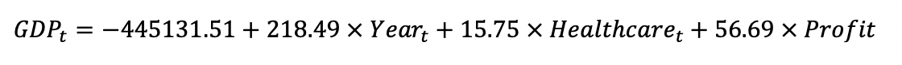
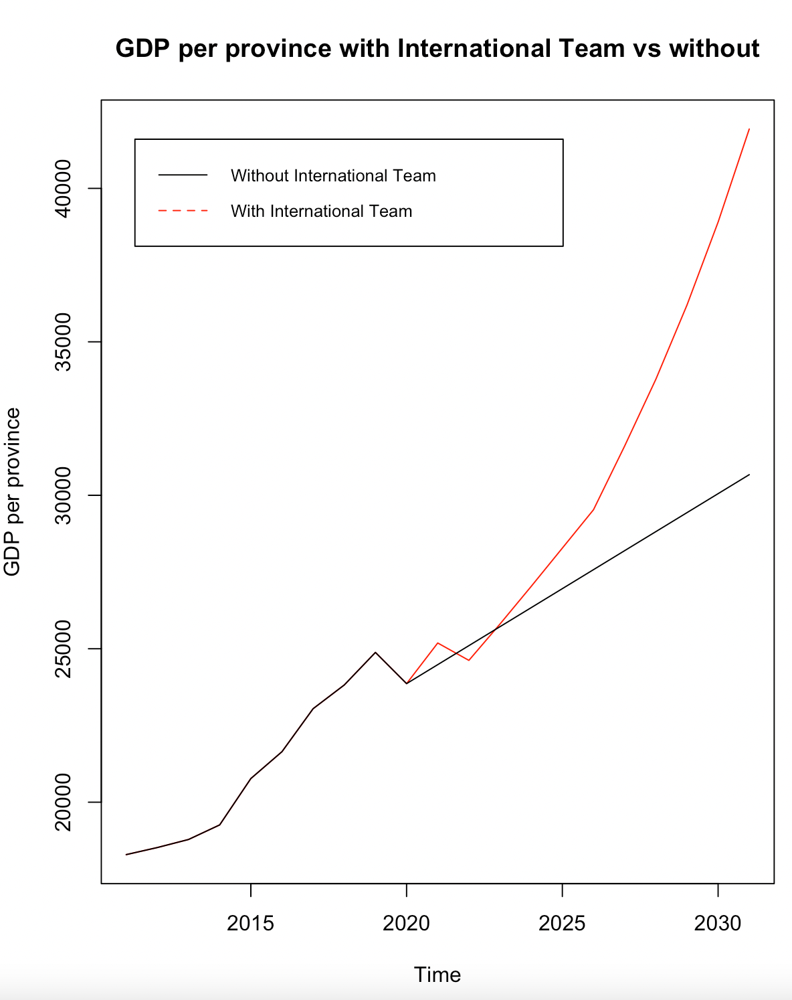
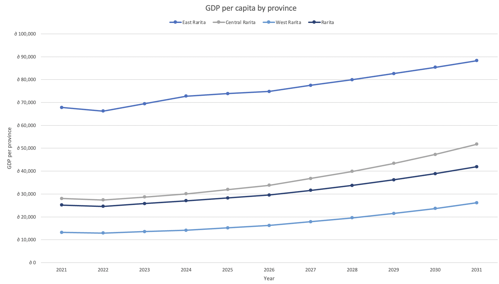
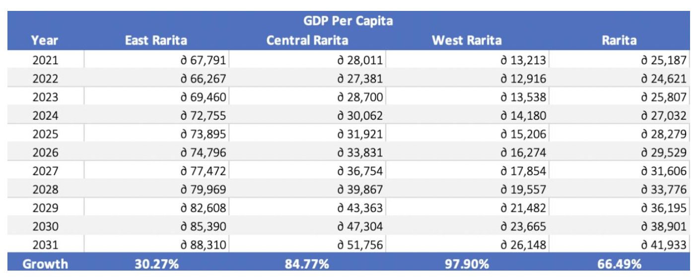
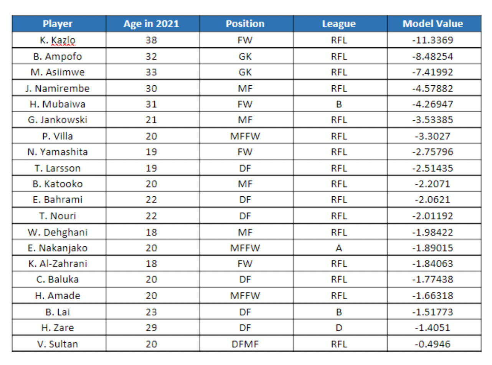

# Rarita's National Football Team Plan

_MARBS Consulting has been hired to form a competitive international football team for Rarita and to analyse the impact of
building a football “brand” on the economy. We hope to provide insight into our findings through our code and key figures._

---

# How did we choose our International Football Team?

## Criteria for Selection

please insert short summary here, perhaps include a few important images ie) tables, graphs etc
then embed the data, code or excel files used as I have done below 

## Probability Ranges of the "Success" being Competitive

please insert short summary here, perhaps include a few important images ie) tables, graphs etc
then embed the data, code or excel files used as I have done below 

## Spending on Assembling Team
please insert short summary here, perhaps include a few important images ie) tables, graphs etc
then embed the data, code or excel files used as I have done below 

## Direct Team Revenues

please insert short summary here, perhaps include a few important images ie) tables, graphs etc
then embed the data, code or excel files used as I have done below 

# Economic Impact

## Impact on GDP

The impact of the implementation plan on GDP was modelled through linear regression using Year, Household Savings, Revenue and Expenses as predictors. Healthcare was forecasted using an ARIMA (0,1,0) model with drift, while revenue and expenses were forecasted according to benchmark countries. The following regression model was used:

This was used to predict the GDP per capita for 2021 to 2031. Furthermore, GDP was forecasted using a time series with an ARIMA (0,1,0) model with drift to compare the difference in GDP if Rarita does not form a national team. 

The output produced is visualised in the following graph, depicting that in the long term the introduction of an International Football team will lead to an increase in GDP. 

The [code](Economic_Impact_Code.ipynb) and data used to create these insights can be accessed through these links for further understanding of the analysis conducted: [Inflation](Economic_Impact_Data/Inflation.csv)  [Household](Economic_Impact_Data/Household.csv)  [Healthcare](Economic_Impact_Data/Healthcare.csv)  [Population](Economic_Impact_Data/Population.csv)  [GDP](Economic_Impact_Data/GDP.csv)  [Rarita_train](Economic_Impact_Data/Rarita_train.csv) [Rarita_predict](Economic_Impact_Data/Rarita_predict.csv) 

## Impact on Rarita Provinces

Through analysis and manipulation in excel the respective impact of GDP on each province was determined as can be seen in the following graph and table. 

This analysis was conducted through the linked excel [document](Economic_Impact_and_Implementation_Plan_Analysis/Rarita_GDP_Economic_Impact.xlsx) while further explanation of assumptions and how this was calculated can be seen in Appendix Q of our [report](MARBS-Rarita-FSA-League-Report-2022.pdf).

# Implementation Plan

## Team Selection

## Sources of Revenue
